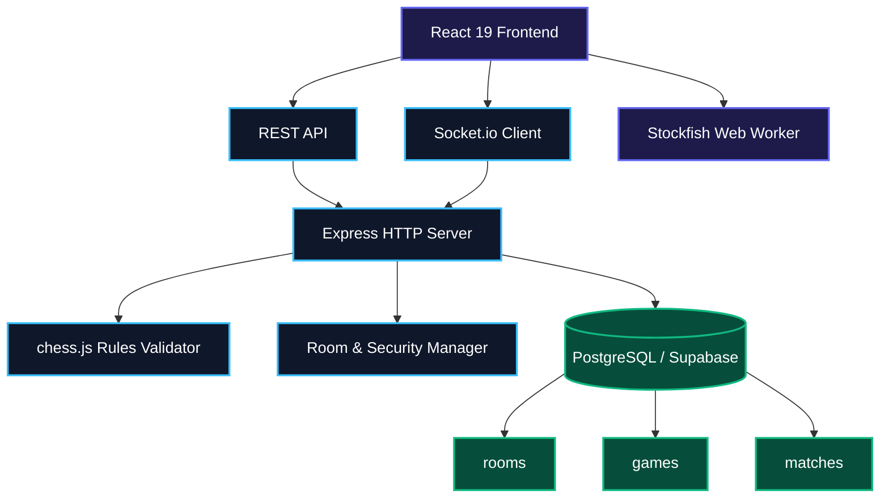
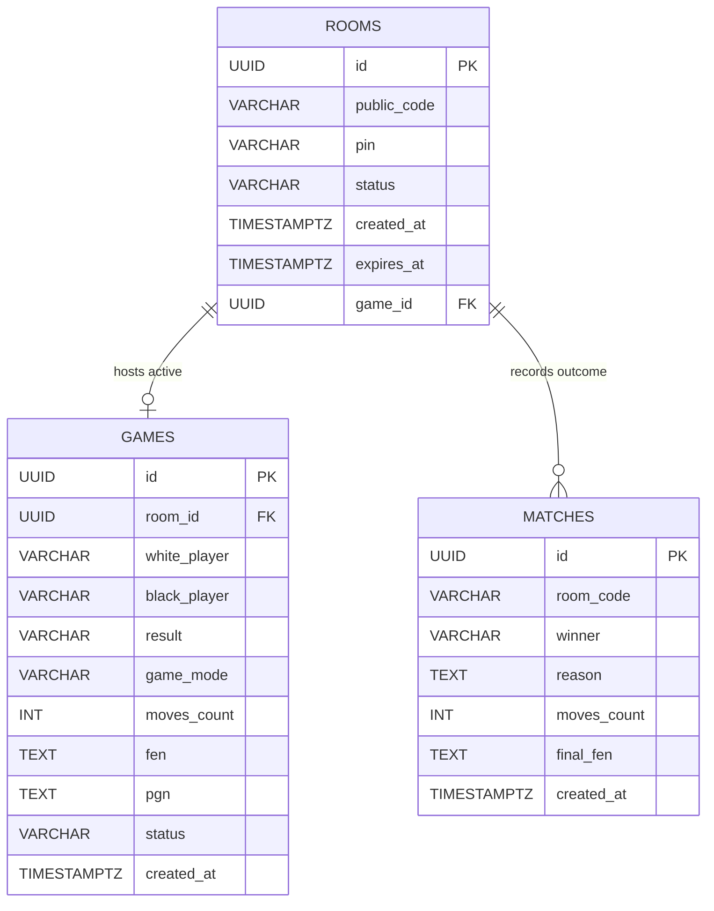

# ♟️ Chess Studio Pro

<p align="center">
  
</p>

<p align="center">
  <b>Manage · Play · Analyze · Organize</b>
</p>

<p align="center">
  A full-stack chess platform featuring AI analysis, real-time multiplayer, match history, and PostgreSQL database storage.
</p>

<p align="center">
  
  
  
  
  
  
  
  
</p>

---

## 📌 Features

* ♟️ **Interactive Chess Board**: Smooth piece movement, legal move indicators, drag-and-drop, touch support, and board flipping.
* 🤖 **Stockfish AI Engine**: Client-side WebAssembly Web Worker with 5 calibrated difficulty levels and depth evaluation.
* 🌐 **Online Multiplayer**: Real-time room matchmaking using collision-free 6-digit room codes.
* 🔐 **Private Rooms with PIN**: Password-protected private rooms to play exclusively with friends.
* 🛡️ **Server-Side Move Validation**: Authoritative rules enforcement powered by `chess.js` to prevent invalid or illegal moves.
* 📊 **Post-Game Analysis**: In-depth move classifications (Best, Good, Inaccuracy, Blunder) and accuracy percentage graphs.
* 📄 **PGN Upload & Download**: Import external games for study or export game notation files in standard PGN format.
* 💾 **Game History**: Persistent game records and interactive move replayer powered by a relational PostgreSQL database.
* ⚡ **Real-Time Updates**: Sub-millisecond move synchronization, draw negotiations, resignations, and rematches via Socket.io.
* 🗄️ **Relational DBMS Storage**: Production-grade database schema utilizing UUIDs, foreign keys, constraints, and indexes.
* 🔒 **Brute-Force Protection**: Automatic IP-level lockout after 5 consecutive failed room or PIN attempts.
* 🧹 **Automated Lifecycle Sweeps**: Periodic background tasks to expire stale rooms and reclaim database/memory resources.

---

## 🛠️ Tech Stack

| Layer | Technology | Purpose |
|---|---|---|
| **Frontend** | React 19 + TypeScript | Type-safe, component-driven reactive user interface |
| **Styling** | Tailwind CSS 3 | Modern dark-mode interface with glassmorphic styling |
| **Chess AI** | Stockfish.js (WASM) | High-performance chess evaluation in a background Web Worker |
| **Backend** | Node.js + Express | RESTful API server and HTTP route handling |
| **Real-Time** | Socket.io 4 | Low-latency bi-directional WebSocket communication |
| **Rules Engine** | chess.js | Authoritative server-side chess rules and move validation |
| **Database** | PostgreSQL / Supabase | Relational data persistence, foreign keys, and indexes |
| **DB Client** | @supabase/supabase-js | Parameterized query builder and PostgreSQL connection pool |

---

## 🏗️ Architecture



---

## 🗄️ Database Design (DBMS)

The application uses **PostgreSQL** to demonstrate relational database principles. The complete DDL is located in `backend/database/schema.sql`.



### Relational Schema

* **`rooms`**:
  * `id` (UUID, Primary Key, default `gen_random_uuid()`)
  * `public_code` (VARCHAR(6), 6-digit active join code)
  * `pin` (VARCHAR(6), optional private room password)
  * `status` (VARCHAR(20), `waiting`, `active`, `finished`, `expired`)
  * `created_at` (TIMESTAMPTZ, default `NOW()`)
  * `expires_at` (TIMESTAMPTZ, session expiration time)
  * `game_id` (UUID, foreign key referencing `games(id)`)

* **`games`**:
  * `id` (UUID, Primary Key, default `gen_random_uuid()`)
  * `user_id` (UUID, optional player identifier)
  * `room_id` (UUID, foreign key referencing `rooms(id)`)
  * `white_player` (VARCHAR(100), White player username)
  * `black_player` (VARCHAR(100), Black player username)
  * `result` (VARCHAR(30), outcome notation `1-0`, `0-1`, `1/2-1/2`)
  * `game_mode` (VARCHAR(30), `computer`, `friend`, `online`)
  * `moves_count` (INT, total half-moves made)
  * `fen` (TEXT, current FEN board representation)
  * `pgn` (TEXT, complete Portable Game Notation)
  * `status` (VARCHAR(30), `waiting`, `playing`, `finished`)
  * `created_at` (TIMESTAMPTZ, default `NOW()`)

* **`matches`**:
  * `id` (UUID, Primary Key, default `gen_random_uuid()`)
  * `room_code` (VARCHAR(6), room code where game occurred)
  * `winner` (VARCHAR(20), `white`, `black`, or `draw`)
  * `reason` (TEXT, checkmate, resignation, draw agreed, or timeout)
  * `moves_count` (INT, total moves completed)
  * `final_fen` (TEXT, final board state FEN)
  * `created_at` (TIMESTAMPTZ, default `NOW()`)

### DBMS Concepts Implemented

* **Relational Integrity**: Foreign key constraints with `ON DELETE SET NULL` prevent orphaned records.
* **UUID Primary Keys**: Non-sequential UUIDv4 keys protect against ID enumeration attacks.
* **Partial Indexes**: `CREATE UNIQUE INDEX idx_rooms_active_code ON rooms(public_code) WHERE status IN ('waiting', 'active')` ensures collision-free active codes while retaining historical records.
* **Database Normalization**: Schema is structured in Third Normal Form (3NF) to minimize data redundancy.

---

## 🔄 How It Works

```text
Player Action
      ↓
Create or Join Room (6-Digit Code + Optional PIN)
      ↓
Socket.io Server Handshake & Role Assignment
      ↓
chess.js Authoritative Move Validation
      ↓
Update FEN & Board State on Server
      ↓
Broadcast Validated Move to Both Players
      ↓
Game Concludes (Checkmate / Resign / Draw)
      ↓
Persist Game Record & PGN to PostgreSQL
      ↓
Run Stockfish Move Quality & Accuracy Analysis
```

---

## 📁 Project Structure

```text
chess-studio-pro/
│
├── backend/
│   ├── chess/                           # Game state & chess.js move validator
│   ├── config/                          # Port, CORS, and rate limit settings
│   ├── database/                        # PostgreSQL schema.sql & connection client
│   ├── rooms/                           # Room manager & brute-force lockout logic
│   ├── tests/                           # Automated test suites (backend.test.js)
│   ├── websocket/                       # Socket.io event listeners & emitters
│   ├── package.json                     # Backend dependencies & test scripts
│   ├── README.md                        # Backend documentation
│   └── server.js                        # Express & WebSocket application entry
│
├── frontend/
│   ├── public/
│   │   ├── favicon.svg                  # Vector application logo
│   │   ├── stockfish.js                 # Stockfish engine Web Worker
│   │   └── stockfish.wasm               # WebAssembly chess engine binary
│   ├── src/
│   │   ├── chess-logic/                 # Piece rules, board logic, PGN parser
│   │   ├── components/                  # Modular UI component architecture
│   │   │   ├── board/                   # ChessBoard, CapturedPieces, MoveList, PromotionModal
│   │   │   ├── layout/                  # Navbar with theme, audio, and mode selectors
│   │   │   ├── modals/                  # DifficultyModal, RoomCodeModal, ThemeModal, GameOverModal
│   │   │   ├── views/                   # AnalysisView and GameHistoryView
│   │   │   └── index.ts                 # Master barrel export
│   │   ├── config/                      # Theme palettes and engine configuration
│   │   ├── services/                    # Socket, API, audio, and Stockfish services
│   │   ├── App.tsx                      # Root state orchestrator
│   │   └── main.tsx                     # React DOM entry point
│   ├── package.json                     # Frontend dependencies & build scripts
│   ├── README.md                        # Frontend documentation
│   ├── tailwind.config.js               # Tailwind CSS theme extension
│   └── vite.config.ts                   # Vite bundler configuration
│
├── package.json                         # Root monorepo scripts (dev, test, build)
├── render.yaml                          # Cloud deployment configuration
└── README.md                            # Primary project documentation
```

---

## 🚀 Installation & Setup

### Prerequisites

* **Node.js**: `18+`
* **npm**: `9+`
* **Git**
* **PostgreSQL** or **Supabase** (server uses in-memory store if omitted)

### 1. Clone Repository

```bash
git clone <repository-url>
cd chess-studio-pro
```

### 2. Install All Dependencies

```bash
npm run install:all
```

### 3. Start Backend Server

```bash
npm run dev:backend
```
Backend runs at: `http://localhost:4000`

### 4. Start Frontend Application

Open a new terminal:

```bash
npm run dev:frontend
```
Frontend runs at: `http://localhost:5173`

---

## 🔐 Environment Variables

### Backend Configuration

Create file `backend/.env`:

```env
PORT=4000
CORS_ORIGIN=*

# PostgreSQL / Supabase Credentials
SUPABASE_URL=https://your-project.supabase.co
SUPABASE_KEY=your-database-anon-key
```

### Frontend Configuration

Create file `frontend/.env`:

```env
VITE_API_URL=http://localhost:4000
VITE_SOCKET_URL=http://localhost:4000
```

---

## 🌐 API Reference

### REST API Endpoints

| Method | Endpoint | Description |
|---|---|---|
| `GET` | `/` | Health check and active room count |
| `GET` | `/health` | Server uptime and operational status |
| `GET` | `/api/games` | Fetch paginated historical games (`?limit=50&offset=0`) |
| `POST` | `/api/games` | Save completed game record with PGN and players |
| `GET` | `/api/matches` | Fetch recent competitive matches and outcomes |

### WebSocket Real-Time Events

| Direction | Event Name | Payload / Description |
|---|---|---|
| **Client → Server** | `create_room` | `{ pin? }` — Request new 6-digit room code |
| **Client → Server** | `join_room` | `{ code, pin? }` — Join existing room |
| **Client → Server** | `send_move` | `{ from, to, promotion? }` — Submit move for validation |
| **Client → Server** | `resign` | `{ code }` — Forfeit current match |
| **Client → Server** | `offer_draw` | `{ code }` — Send draw proposal to opponent |
| **Client → Server** | `respond_draw` | `{ code, accept }` — Accept or decline draw offer |
| **Client → Server** | `request_rematch` | `{ code }` — Request rematch with reversed colors |
| **Client → Server** | `leave_room` | `{ code }` — Disconnect from current room |
| **Server → Client** | `room_created` | `{ code, color }` — Dispatches assigned room & color |
| **Server → Client** | `player_joined` | `{ color }` — Notifies host opponent connected |
| **Server → Client** | `receive_move` | `{ move, fen, isCheck, isCheckmate }` — Broadcasts valid move |
| **Server → Client** | `game_over` | `{ winner, reason }` — Final outcome broadcast |
| **Server → Client** | `draw_offered` | `{ from }` — Alerts opponent of draw offer |
| **Server → Client** | `rematch_started`| `{ fen, color }` — Starts new game with reversed colors |

---

## 🔒 Security & Data Integrity

* **Server-Authoritative Validation**: All moves are verified against official FIDE rules via `chess.js` on the server before updating state.
* **Brute-Force Protection**: An IP address is automatically blocked for 5 minutes after 5 consecutive failed room or PIN attempts.
* **UUID Isolation**: Database records utilize random UUIDv4 identifiers, preventing ID enumeration and predictable scraping.
* **SQL Injection Prevention**: All queries use parameterized inputs through `@supabase/supabase-js`.
* **Automated Expiration Sweeps**: Background sweeps evict stale or abandoned rooms every 5 minutes to reclaim resources.
* **Environment Secret Isolation**: Sensitive database keys and connection URLs are kept strictly in `.env` files.

---

## 🧪 Testing & Verification

Run the automated backend test suite:

```bash
npm test
```
> Validates room code generation, PIN security, IP brute-force lockout, session expiration, and `chess.js` legal move validation.

Build frontend for production:

```bash
npm run build
```

---

## 🎯 Main Gameplay Workflow

```text
Launch Web Application
        ↓
Select Game Mode (vs Computer · Pass & Play · Online Room)
        ↓
Create or Join Room (Enter 6-Digit Code & PIN)
        ↓
Play Real-Time Chess with Interactive Drag & Drop
        ↓
Server Authoritatively Validates Every Move
        ↓
Game Ends (Checkmate / Resignation / Agreed Draw)
        ↓
Save Match Record & PGN to PostgreSQL Database
        ↓
Inspect Post-Game Stockfish Accuracy & Move Evaluations
        ↓
Download or Copy PGN Notation for External Analysis
```

---

## 📜 License

This project is licensed under the **MIT License**. Created for academic and educational purposes.
